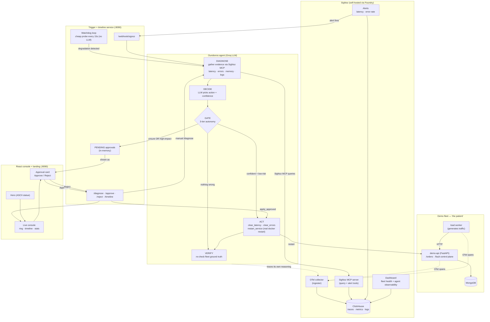

# Ouroboros — Architecture

A self-observing, self-healing SRE agent. It watches a demo fleet through SigNoz,
diagnoses incidents, and remediates them under a three-tier autonomy model
(auto-heal / propose-for-approval / no-action). Every decision the agent makes is
itself OpenTelemetry-traced into SigNoz — you watch the watcher.

## The three-tier autonomy model

| Tier | Condition | What happens |
|------|-----------|--------------|
| **Auto-heal** | Confident (≥ auto threshold) **and** low blast-radius | Executes the fix immediately, then verifies |
| **Propose** | Not confident enough, **or** a high-impact action (e.g. `restart_service`) | Parks an approval card; a human clicks Approve → it runs |
| **No action** | Evidence shows the service is healthy | Does nothing (proves the agent doesn't "fix" what isn't broken) |

## Two kinds of remediation

- **Config reverts** (`clear_latency`, `clear_errors`) — flip the demo-api's fault
  control back to healthy; a stand-in for a feature-flag / bad-config rollback.
  Low blast radius, eligible for auto-heal.
- **Real infrastructure action** (`restart_service`) — actually runs
  `docker restart` on the demo-api container, like restarting an unhealthy pod.
  Genuinely reclaims leaked memory. High blast radius → always approval-gated.
